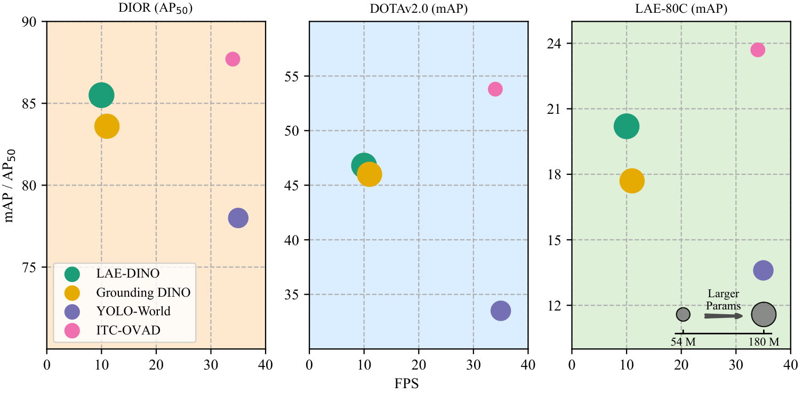
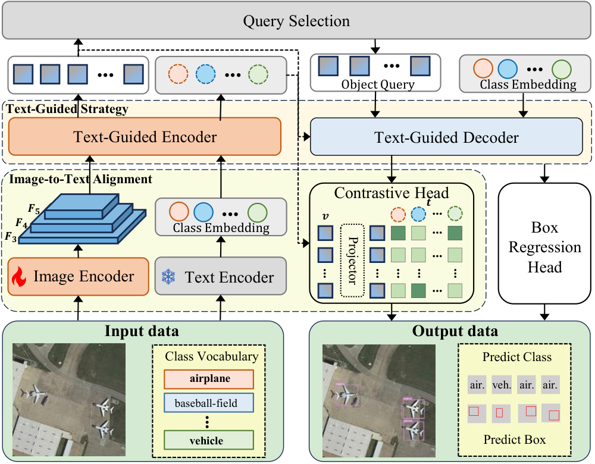
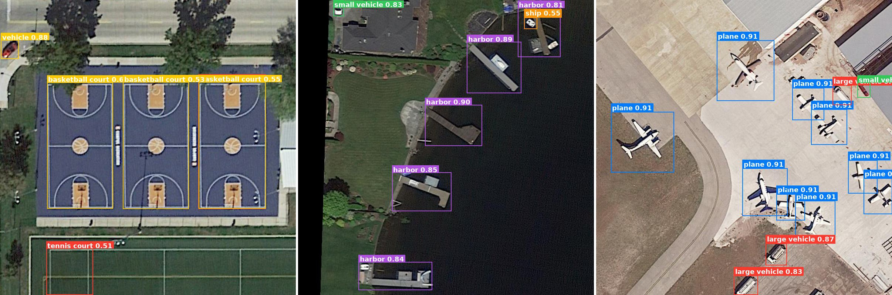
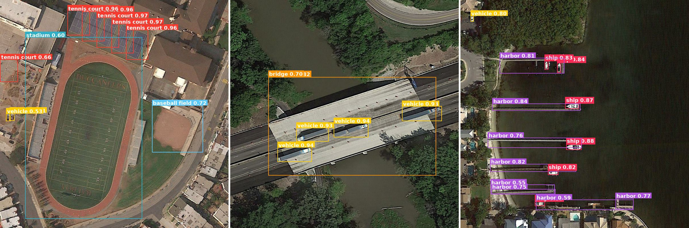
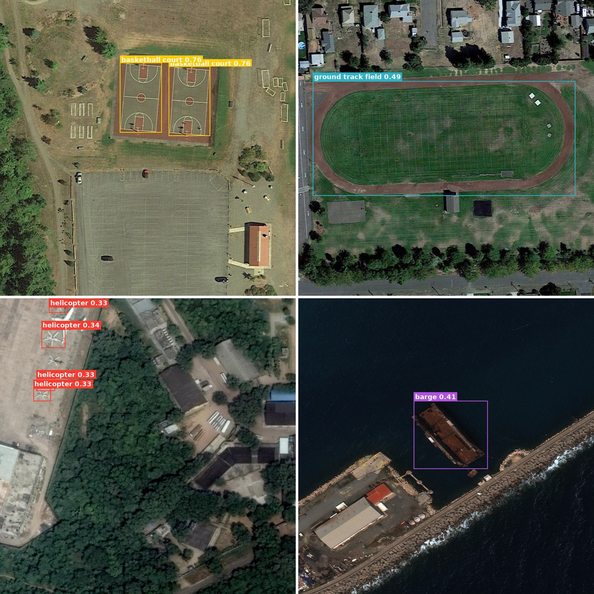
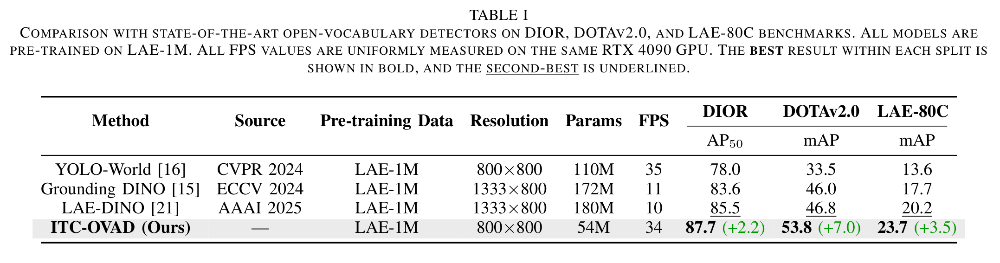
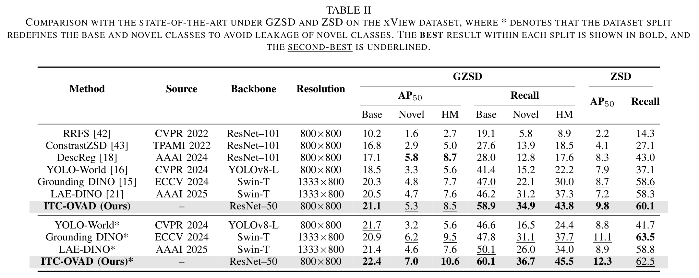
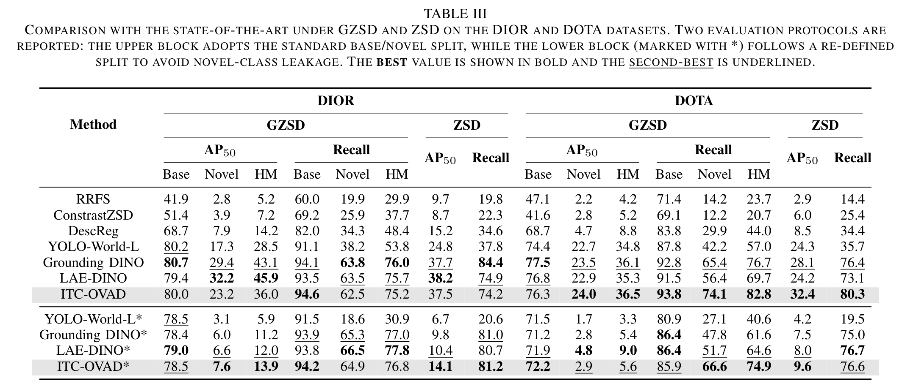
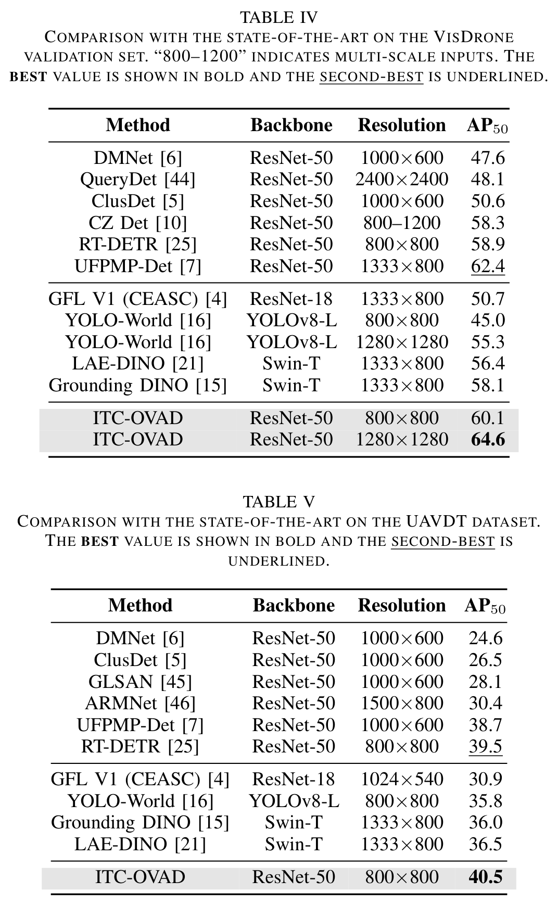

# ITC-OVAD: An Image-Text Collaborative Strategy for Open-Vocabulary Aerial Detection

<p align="center">
  <i>
    Guoting Wei<sup>1,4*</sup>, Xia Yuan<sup>1*</sup>, Yu Liu<sup>3*</sup>, Zhenhao Shang<sup>2</sup>, Xizhe Xue<sup>2</sup>, Peng Wang<sup>2</sup>,  Kelu Yao<sup>3</sup> <br>
    Chunxia Zhao<sup>1</sup>, Haokui Zhang<sup>2,4†</sup>, Rong Xiao<sup>4</sup>
  </i>
</p>

<p align="center">
  <sup>*</sup>Equal Contribution &nbsp;&nbsp;&nbsp; <sup>†</sup>Corresponding Author
</p>

<p align="center">
  <a href="https://huggingface.co/Guoting/ITC-OVAD"></a>
  <a href="https://huggingface.co/datasets/Guoting/ITC-OVAD-eval"></a>
  <a href="LICENSE"></a>
  
</p>

<p align="center">
  
</p>

---

### 🏢 Affiliations

- <sup>1</sup> Nanjing University of Science and Technology
- <sup>2</sup> Northwestern Polytechnical University
- <sup>3</sup> Zhejiang Lab
- <sup>4</sup> Intellifusion Inc. 


---

## 📝 **TODO**:

- ✅ Inference code & demo
- ✅ Evaluation code (reproduce the metrics)
- ✅ Pretrained model weights
- 🔲 Training code (to be released after paper acceptance)


---

## 🚀 Quick Start

```bash
# 1. install (Python 3.10, CUDA recommended)
pip install -r requirements.txt

# 2. run open-vocabulary detection on an image
python demo.py \
    --resume weights/itc_ovad_dior_dota.pth \
    --image  path/to/aerial.jpg \
    --class-names "airplane,ship,storage tank,harbor,bridge,vehicle" \
    --output result.jpg

# or load a ready-made class list (JSON: [["cls1"], ["cls2"], ...])
python demo.py -r weights/itc_ovad_dior_dota.pth -i path/to/aerial.jpg \
    --vocab class_text_dict/eval_detail_v1.5/DIOR_GZSD.json
```

### Released Weights

The checkpoints are hosted on the Hugging Face Hub at [**Guoting/ITC-OVAD**](https://huggingface.co/Guoting/ITC-OVAD). Download them into `weights/`:

```bash
hf download Guoting/ITC-OVAD --local-dir weights
# (older huggingface_hub: huggingface-cli download Guoting/ITC-OVAD --local-dir weights)
```

| File | Task | Recommended for | Reported (single ckpt) |
|---|---|---|---|
| `itc_ovad_dior_dota.pth` | Zero-shot | DIOR / DOTA | DIOR 15.1 · DOTA 11.8 (AP₅₀) |
| `itc_ovad_xview.pth` | Zero-shot | xView | 13.2 (AP₅₀) |
| `itc_ovad_lae1m.pth` | Open-vocabulary | DIOR / DOTA-v2.0 / LAE-80C | DIOR 88.2 AP₅₀ · DOTA-v2.0 54.4 mAP · LAE-80C 22.6 mAP |

> **Note.** The weights released here were **independently re-trained on a public machine** and achieve performance comparable to that reported in the paper. The original checkpoints used in the paper were trained on an internal corporate network and are not readily available.

### Reproduce the Metrics

The validation sets (processed/cropped derivatives, see [DATASETS.md](DATASETS.md)) are hosted at [**Guoting/ITC-OVAD-eval**](https://huggingface.co/datasets/Guoting/ITC-OVAD-eval). Download them into `datasets/`:

```bash
hf download Guoting/ITC-OVAD-eval --repo-type dataset --local-dir datasets
```

The layout matches the paths in `configs/itc-ovad/eval.yml`:

```
datasets/
├── DIOR/val/{images, labelXML}
├── DOTA/val/{images, labelXML}
├── xView/val/{images, labelXML}
└── annotations/   # COCO-format ground truth (*_GZSD / *_ZSD .json)
```

Then evaluate (per-split AP50 Base/Novel/HM and Recall are printed):

```bash
# DIOR & DOTA splits
python eval.py -c configs/itc-ovad/eval.yml -r weights/itc_ovad_dior_dota.pth
# xView split
python eval.py -c configs/itc-ovad/eval.yml -r weights/itc_ovad_xview.pth
```

`eval.yml` evaluates six sub-sets in order — DIOR-GZSD, DIOR-ZSD, DOTA-GZSD, DOTA-ZSD, xView-GZSD, xView-ZSD. Read the DIOR/DOTA rows from the first run and the xView rows from the second.

#### Open-Vocabulary (LAE-1M) evaluation

The LAE-1M / LAE-80C benchmark is **not redistributed here** — download it (DIOR, DOTA-v2.0 and the 80-class LAE-80C splits) from the official [LAE-DINO release](https://github.com/jaychempan/LAE-DINO) ([🤗 HF](https://huggingface.co/jaychempan/LAE-DINO)) and arrange it as:

```
datasets/LAE-1M/
├── LAE-80C/ {images, LAE-80C-benchmark-remap.json}
├── DOTAv2/  {images, DOTAv2_val_remap.json}
└── DIOR/    {images, DIOR_val_remap.json}
```

Then evaluate (per-category and binned mAP / AP₅₀ / Recall₅₀ are printed for LAE-80C, DOTA-v2.0 and DIOR):

```bash
python eval.py -c configs/itc-ovad/eval_lae1m.yml -r weights/itc_ovad_lae1m.pth
```


---

## 🔍 Abstract

Aerial object detection plays a crucial role in numerous applications. However, most existing methods focus on detecting predefined object categories, limiting their applicability in real-world open scenarios. In this paper, we extend aerial object detection to open scenarios through image-text collaboration and propose ITC-OVAD, an end-to-end open-vocabulary detector for aerial imagery.
Specifically, we first introduce an image-to-text alignment loss to replace the conventional category regression loss, thereby eliminating category constraints.
Next, we propose a lightweight image–text collaboration strategy with bidirectional modulation between visual and textual modalities. Specifically, this strategy comprises three modules: Text-Guided Feature Enhancement (TG-FE) and Visual-Guided Text Refinement (VG-TR) in the encoder, and Text-Guided Query Enhancement (TG-QE) in the decoder, which together enrich visual features with class semantics and refine class embeddings with visual context, improving detection accuracy without incurring significant computational overhead.
Extensive experiments demonstrate that ITC-OVAD consistently outperforms existing state-of-the-art methods across open-vocabulary, zero-shot, and traditional closed-set detection tasks. For instance, on the open-vocabulary aerial detection benchmarks DIOR, DOTA-v2.0, and LAE-80C, ITC-OVAD achieves 87.7 AP₅₀, 53.8 mAP, and 23.7 mAP, respectively, surpassing the previous state-of-the-art (LAE-DINO) by 2.2, 7.0, and 3.5 points. Meanwhile, ITC-OVAD achieves real-time inference at 34 FPS on an RTX 4090 GPU, approximately three times faster than LAE-DINO (10 FPS).

<p align="center">
  <br>
  <sub>Overview of ITC-OVAD. An image-to-text alignment objective replaces category regression to lift the closed-set constraint, and a lightweight image–text collaboration — TG-FE &amp; VG-TR in the encoder, TG-QE in the decoder — bidirectionally enriches visual features with class semantics and refines class embeddings with visual context.</sub>
</p>

---

## ✨ Highlights

- 🏷️ **Open-vocabulary detection** enabled by an image-to-text alignment loss.
- 🔁 **Image–text collaboration** with bidirectional modulation via three lightweight modules (TG-FE, VG-TR, TG-QE).
- ⚡ **Real-time inference**: 34 FPS on RTX 4090.
- 📈 **SOTA performance** across Open-Vocabulary Aerial Detection, Zero-Shot Detection, and Closed-set Detection tasks.

---

## 📊 Results

### Qualitative Results

Open-vocabulary detection across DIOR / DOTA / xView:

<p align="center">
  
</p>
<p align="center">
  
</p>

Zero-shot detection of **novel** categories (basketball court, ground-track field, helicopter, barge):

<p align="center">
  
</p>

### 1. Open-Vocabulary Aerial Detection

<p align="center">
  
</p>

### 2. Zero-shot Aerial Detection

<p align="center">
  
</p>

<p align="center">
  
</p>

### 3. Closed-Set Aerial Detection

<p align="center">
  
</p>


---

## 📦 Datasets

ITC-OVAD is trained and evaluated on the datasets below. **Only the validation sets required to reproduce the reported metrics are released here** (see [Reproduce the Metrics](#reproduce-the-metrics) above); the training data and training code will be released after paper acceptance.

### 1. Open-Vocabulary Aerial Detection
- **Training**: LAE-1M
- **Evaluation**: DIOR, DOTA-v2.0, LAE-80C

### 2. Zero-Shot Aerial Detection
- Training: DIOR, DOTA, xView Base data
- GZSD & ZSD evaluation: DIOR, DOTA, xView (Base/novel split)

### 3. Closed-Set Aerial Detection
- VisDrone, UAVDT

> **Data sources & licensing.** The validation images provided for reproducing the
> metrics are **processed (cropped/tiled) derivatives** of DIOR, DOTA and xView,
> released here for research reproducibility only. They are not the original
> imagery — please follow each dataset's original license (xView is **CC BY-NC-SA
> 4.0, non-commercial**; DOTA is **academic-use only**). See [DATASETS.md](DATASETS.md)
> for full attribution and terms.

---

## 📄 License

The **code** in this repository is released under the [Apache-2.0 License](LICENSE). The released **validation data** are processed derivatives of DIOR, DOTA and xView and remain under their original licenses (xView: CC BY-NC-SA 4.0, non-commercial; DOTA / DIOR: academic use only) — see [DATASETS.md](DATASETS.md).

---

## 🤝 Contact

- 📧 Guoting Wei (weiguoting@njust.edu.cn)
- 📧 Haokui Zhang (hkzhang@nwpu.edu.cn)

---
